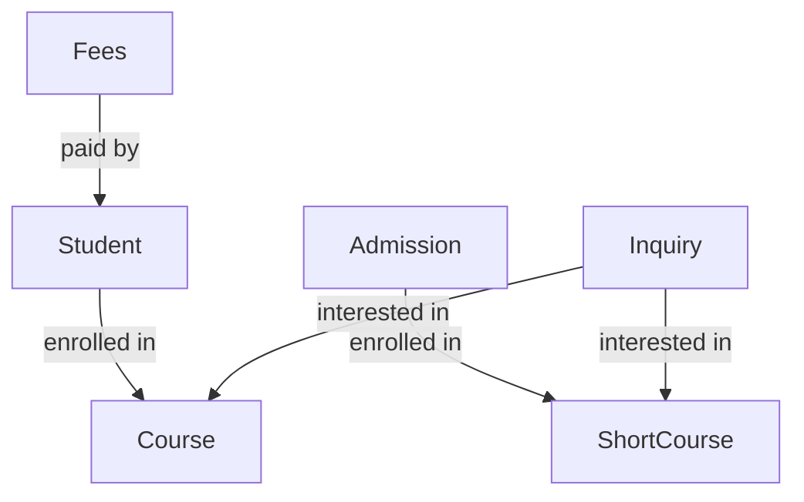

# MAA Computer Backend API Documentation

> **AI-Friendly API Reference** - Complete documentation for understanding and interacting with the MAA Computer Management System API

## Table of Contents

1. [Overview](#overview)
2. [Base URL & Authentication](#base-url--authentication)
3. [Response Format](#response-format)
4. [API Endpoints](#api-endpoints)
   - [Authentication](#1-authentication-api)
   - [Students](#2-students-api)
   - [Admissions](#3-admissions-api)
   - [Courses](#4-courses-api)
   - [Inquiries](#5-inquiries-api)
   - [Staff](#6-staff-api)
   - [Universities](#7-universities-api)
   - [Fees](#8-fees-api)
   - [Dashboard](#9-dashboard-api)

---

## Overview

The MAA Computer Backend API is a RESTful API built with **Node.js**, **Express**, and **MongoDB** for managing an educational institution's operations including student enrollment, admissions, course management, fee tracking, and staff management.

### Tech Stack

- **Runtime**: Node.js
- **Framework**: Express.js
- **Database**: MongoDB with Mongoose ODM
- **Authentication**: JWT (JSON Web Tokens)
- **Password Hashing**: bcryptjs

---

## Base URL & Authentication

### Base URL

```
http://localhost:5000/api
```

### Authentication

All routes (except `/api/auth/register` and `/api/auth/login`) require JWT authentication.

**How to Authenticate:**

1. Obtain a token by logging in via `/api/auth/login`
2. Include the token in the `Authorization` header for all protected requests

**Header Format:**

```
Authorization: Bearer <your_jwt_token>
```

**Token Storage:**

- Tokens are returned in the login/register response
- Store securely on client-side (e.g., localStorage, secure cookies)

---

## Response Format

All API responses follow a consistent format:

### Success Response

```json
{
  "success": true,
  "message": "Operation successful",
  "data": {
    /* response data */
  }
}
```

### Error Response

```json
{
  "success": false,
  "message": "Error description"
}
```

### HTTP Status Codes

- `200` - Success
- `201` - Created
- `400` - Bad Request
- `401` - Unauthorized
- `404` - Not Found
- `500` - Internal Server Error

---

## API Endpoints

---

## 1. Authentication API

**Base Path:** `/api/auth`

### Register User

Create a new user account (admin or staff).

- **Endpoint:** `POST /api/auth/register`
- **Authentication:** None (Public)
- **Request Body:**

```json
{
  "username": "johndoe",
  "email": "john@example.com",
  "password": "password123",
  "role": "staff" // "admin" or "staff"
}
```

- **Response (201):**

```json
{
  "success": true,
  "message": "User registered successfully",
  "data": {
    "user": {
      "_id": "64abc123...",
      "username": "johndoe",
      "email": "john@example.com",
      "role": "staff"
    },
    "token": "eyJhbGciOiJIUzI1NiIsInR5cCI6IkpXVCJ9..."
  }
}
```

### Login

Authenticate and receive JWT token.

- **Endpoint:** `POST /api/auth/login`
- **Authentication:** None (Public)
- **Request Body:**

```json
{
  "email": "john@example.com",
  "password": "password123"
}
```

- **Response (200):**

```json
{
  "success": true,
  "message": "Login successful",
  "data": {
    "user": {
      "_id": "64abc123...",
      "username": "johndoe",
      "email": "john@example.com",
      "role": "staff"
    },
    "token": "eyJhbGciOiJIUzI1NiIsInR5cCI6IkpXVCJ9..."
  }
}
```

### Get Current User

Retrieve authenticated user's information.

- **Endpoint:** `GET /api/auth/me`
- **Authentication:** Required ✅
- **Response (200):**

```json
{
  "success": true,
  "message": "User retrieved successfully",
  "data": {
    "_id": "64abc123...",
    "username": "johndoe",
    "email": "john@example.com",
    "role": "staff"
  }
}
```

---

## 2. Students API

**Base Path:** `/api/students`

### Get All Students

Retrieve list of all students with optional filtering.

- **Endpoint:** `GET /api/students`
- **Authentication:** Required ✅
- **Query Parameters:**
  - `contactNumber` (optional) - Filter by contact number
  - `course` (optional) - Filter by course ID
  - `session` (optional) - Filter by session (e.g., "2023-2024")
- **Response (200):**

```json
{
  "success": true,
  "message": "Students retrieved successfully",
  "data": [
    {
      "_id": "64abc123...",
      "firstName": "Rajesh",
      "lastName": "Kumar",
      "email": "rajesh@example.com",
      "fatherName": "Suresh Kumar",
      "contactNumber": 9876543210,
      "course": {
        "_id": "64def456...",
        "courseName": "BCA",
        "courseCode": "BCA-101"
      },
      "qualification": "12th Pass",
      "address": "123 Main St, Delhi",
      "r_no": 1001,
      "session": "2023-2024",
      "gender": "male",
      "createdAt": "2024-01-15T10:30:00.000Z"
    }
  ]
}
```

### Get Student by ID

Retrieve a specific student.

- **Endpoint:** `GET /api/students/:id`
- **Authentication:** Required ✅
- **Response (200):** Same as individual student object above

### Create Student

Add a new student to the system.

- **Endpoint:** `POST /api/students`
- **Authentication:** Required ✅
- **Request Body:**

```json
{
  "firstName": "Rajesh",
  "lastName": "Kumar",
  "email": "rajesh@example.com",
  "fatherName": "Suresh Kumar",
  "contactNumber": 9876543210,
  "course": "64def456...", // Course ObjectId
  "qualification": "12th Pass",
  "address": "123 Main St, Delhi",
  "gender": "male",
  "session": "2023-2024",
  "sessionMonth": "January",
  "joiningDate": "2024-01-15",
  "dateOfBirth": "2000-05-10",
  "medium": "english", // "hindi" or "english"
  "category": "General", // "SC", "ST", "OBC", "General"
  "addharNo": "123456789012",
  "mainSubject": "Computer Science",
  "yearOfPassing": 2023,
  "division": 1, // 1, 2, 3, or 4
  "percentageOfMarks": 85.5,
  "boardOrUniversity": "CBSE"
}
```

- **Response (201):** Returns created student object

### Update Student

Modify existing student information.

- **Endpoint:** `PUT /api/students/:id`
- **Authentication:** Required ✅
- **Request Body:** Same as create (partial updates allowed)
- **Response (200):** Returns updated student object

### Delete Student

Remove a student from the system.

- **Endpoint:** `DELETE /api/students/:id`
- **Authentication:** Required ✅
- **Response (200):**

```json
{
  "success": true,
  "message": "Student deleted successfully",
  "data": null
}
```

---

## 3. Admissions API

**Base Path:** `/api/admissions`

Admissions are for **short-term courses** (e.g., computer courses, certifications).

### Get All Admissions

- **Endpoint:** `GET /api/admissions`
- **Authentication:** Required ✅
- **Query Parameters:**
  - `contactNumber` (optional)
  - `course` (optional) - Filter by ShortCourse ID
- **Response (200):**

```json
{
  "success": true,
  "message": "Admissions retrieved successfully",
  "data": [
    {
      "_id": "64ghi789...",
      "firstName": "Priya",
      "lastName": "Sharma",
      "fatherName": "Ramesh Sharma",
      "motherName": "Sunita Sharma",
      "contactNumber": 9123456789,
      "course": {
        "_id": "64jkl012...",
        "courseName": "Tally",
        "duration": "3 months"
      },
      "qualification": "Graduate",
      "joiningDate": "2024-02-01",
      "gender": "female",
      "address": "456 Park Ave, Mumbai",
      "registrationPayment": "5000",
      "registrationPaymentMode": "Cash",
      "installment": "Monthly",
      "due": 5000,
      "dueDate": "2024-03-01"
    }
  ]
}
```

### Get Admission by ID

- **Endpoint:** `GET /api/admissions/:id`
- **Authentication:** Required ✅

### Create Admission

- **Endpoint:** `POST /api/admissions`
- **Authentication:** Required ✅
- **Request Body:**

```json
{
  "firstName": "Priya",
  "lastName": "Sharma",
  "fatherName": "Ramesh Sharma",
  "motherName": "Sunita Sharma",
  "contactNumber": 9123456789,
  "course": "64jkl012...", // ShortCourse ObjectId
  "qualification": "Graduate",
  "joiningDate": "2024-02-01",
  "dateOfBirth": "1998-08-20",
  "gender": "female",
  "address": "456 Park Ave, Mumbai",
  "registrationPayment": "5000",
  "registrationPaymentMode": "Cash",
  "installment": "Monthly",
  "due": 5000,
  "dueDate": "2024-03-01"
}
```

### Update Admission

- **Endpoint:** `PUT /api/admissions/:id`
- **Authentication:** Required ✅

### Delete Admission

- **Endpoint:** `DELETE /api/admissions/:id`
- **Authentication:** Required ✅

---

## 4. Courses API

**Base Path:** `/api/courses`

Manages both **diploma courses** (main courses) and **short courses**.

### Diploma Courses (Main Courses)

#### Get All Courses

- **Endpoint:** `GET /api/courses`
- **Authentication:** Required ✅
- **Response (200):**

```json
{
  "success": true,
  "message": "Courses retrieved successfully",
  "data": [
    {
      "_id": "64def456...",
      "courseName": "BCA (Bachelor of Computer Applications)",
      "courseCode": "BCA-101",
      "courseDuration": "3 years",
      "courseFee": 50000
    }
  ]
}
```

#### Get Course by ID

- **Endpoint:** `GET /api/courses/:id`
- **Authentication:** Required ✅

#### Create Course

- **Endpoint:** `POST /api/courses`
- **Authentication:** Required ✅
- **Request Body:**

```json
{
  "courseName": "BCA (Bachelor of Computer Applications)",
  "courseCode": "BCA-101",
  "courseDuration": "3 years",
  "courseFee": 50000
}
```

#### Update Course

- **Endpoint:** `PUT /api/courses/:id`
- **Authentication:** Required ✅

#### Delete Course

- **Endpoint:** `DELETE /api/courses/:id`
- **Authentication:** Required ✅

### Short Courses

#### Get All Short Courses

- **Endpoint:** `GET /api/courses/short`
- **Authentication:** Required ✅
- **Response (200):**

```json
{
  "success": true,
  "message": "Short courses retrieved successfully",
  "data": [
    {
      "_id": "64jkl012...",
      "courseName": "Tally Professional",
      "courseCode": "TALLY-01",
      "duration": "3 months",
      "courseFee": 15000
    }
  ]
}
```

#### Get Short Course by ID

- **Endpoint:** `GET /api/courses/short/:id`
- **Authentication:** Required ✅

#### Create Short Course

- **Endpoint:** `POST /api/courses/short`
- **Authentication:** Required ✅
- **Request Body:**

```json
{
  "courseName": "Tally Professional",
  "courseCode": "TALLY-01",
  "duration": "3 months",
  "courseFee": 15000
}
```

#### Update Short Course

- **Endpoint:** `PUT /api/courses/short/:id`
- **Authentication:** Required ✅

#### Delete Short Course

- **Endpoint:** `DELETE /api/courses/short/:id`
- **Authentication:** Required ✅

---

## 5. Inquiries API

**Base Path:** `/api/inquiries`

Manages student and admission inquiries from prospective students.

> **Note:** The `course` field uses dynamic references via `refPath`. The `courseModelType` field determines whether it references a `Course` or `ShortCourse`.

### Get All Inquiries

- **Endpoint:** `GET /api/inquiries`
- **Authentication:** Required ✅
- **Query Parameters:**
  - `contactNumber` (optional) - Filter by contact number
- **Response (200):**

```json
{
  "success": true,
  "message": "Inquiries retrieved successfully",
  "data": [
    {
      "_id": "64mno345...",
      "inquiryType": "student", // "student" or "admission"
      "firstName": "Amit",
      "lastName": "Patel",
      "email": "amit@example.com",
      "fatherName": "Vijay Patel",
      "contactNumber": "9988776655",
      "course": {
        "_id": "64def456...",
        "courseName": "BCA",
        "courseCode": "BCA-101"
      },
      "courseModelType": "Course", // "Course" or "ShortCourse"
      "qualification": "12th Pass",
      "address": "789 Lake Road, Pune",
      "rejected": false,
      "registered": false,
      "createdAt": "2024-03-10T14:20:00.000Z"
    }
  ]
}
```

### Get Inquiry by ID

- **Endpoint:** `GET /api/inquiries/:id`
- **Authentication:** Required ✅

### Create Inquiry

- **Endpoint:** `POST /api/inquiries`
- **Authentication:** Required ✅
- **Request Body:**

```json
{
  "inquiryType": "student",
  "firstName": "Amit",
  "lastName": "Patel",
  "email": "amit@example.com",
  "fatherName": "Vijay Patel",
  "contactNumber": "9988776655",
  "course": "64def456...", // ObjectId
  "courseModelType": "Course", // REQUIRED: "Course" or "ShortCourse"
  "qualification": "12th Pass",
  "address": "789 Lake Road, Pune"
}
```

> **Important:** When creating an inquiry, you **must** provide both `course` (ObjectId) and `courseModelType` ("Course" or "ShortCourse") to properly reference the course.

### Update Inquiry

- **Endpoint:** `PUT /api/inquiries/:id`
- **Authentication:** Required ✅

### Delete Inquiry

- **Endpoint:** `DELETE /api/inquiries/:id`
- **Authentication:** Required ✅

### Reject Inquiry

Mark an inquiry as rejected.

- **Endpoint:** `PATCH /api/inquiries/:id/reject`
- **Authentication:** Required ✅
- **Response (200):**

```json
{
  "success": true,
  "message": "Inquiry rejected successfully",
  "data": {
    "_id": "64mno345...",
    "rejected": true
    // ... other fields
  }
}
```

### Accept Inquiry

Mark an inquiry as accepted/registered.

- **Endpoint:** `PATCH /api/inquiries/:id/accept`
- **Authentication:** Required ✅
- **Response (200):**

```json
{
  "success": true,
  "message": "Inquiry accepted successfully",
  "data": {
    "_id": "64mno345...",
    "registered": true
    // ... other fields
  }
}
```

---

## 6. Staff API

**Base Path:** `/api/staff`

### Get All Staff

- **Endpoint:** `GET /api/staff`
- **Authentication:** Required ✅
- **Response (200):**

```json
{
  "success": true,
  "message": "Staff retrieved successfully",
  "data": [
    {
      "_id": "64pqr678...",
      "firstName": "Neha",
      "lastName": "Singh",
      "email": "neha@maacomputer.com",
      "contactNumber": "9871234560",
      "position": "Senior Instructor",
      "department": "Computer Science",
      "joiningDate": "2022-06-15",
      "salary": 35000
    }
  ]
}
```

### Get Staff by ID

- **Endpoint:** `GET /api/staff/:id`
- **Authentication:** Required ✅

### Create Staff

- **Endpoint:** `POST /api/staff`
- **Authentication:** Required ✅
- **Request Body:**

```json
{
  "firstName": "Neha",
  "lastName": "Singh",
  "email": "neha@maacomputer.com",
  "contactNumber": "9871234560",
  "position": "Senior Instructor",
  "department": "Computer Science",
  "joiningDate": "2022-06-15",
  "salary": 35000
}
```

### Update Staff

- **Endpoint:** `PUT /api/staff/:id`
- **Authentication:** Required ✅

### Delete Staff

- **Endpoint:** `DELETE /api/staff/:id`
- **Authentication:** Required ✅

---

## 7. Universities API

**Base Path:** `/api/universities`

### Get All Universities

- **Endpoint:** `GET /api/universities`
- **Authentication:** Required ✅
- **Response (200):**

```json
{
  "success": true,
  "message": "Universities retrieved successfully",
  "data": [
    {
      "_id": "64stu901...",
      "universityName": "University of Delhi",
      "location": "Delhi, India"
    }
  ]
}
```

### Get University by ID

- **Endpoint:** `GET /api/universities/:id`
- **Authentication:** Required ✅

### Create University

- **Endpoint:** `POST /api/universities`
- **Authentication:** Required ✅
- **Request Body:**

```json
{
  "universityName": "University of Delhi",
  "location": "Delhi, India"
}
```

### Update University

- **Endpoint:** `PUT /api/universities/:id`
- **Authentication:** Required ✅

### Delete University

- **Endpoint:** `DELETE /api/universities/:id`
- **Authentication:** Required ✅

---

## 8. Fees API

**Base Path:** `/api/fees`

### Get All Fees

Retrieve all fee records.

- **Endpoint:** `GET /api/fees`
- **Authentication:** Required ✅
- **Query Parameters:**
  - `studentId` (optional) - Filter by student ID
  - `status` (optional) - Filter by payment status
- **Response (200):**

```json
{
  "success": true,
  "message": "Fees retrieved successfully",
  "data": [
    {
      "_id": "64vwx234...",
      "student": {
        "_id": "64abc123...",
        "firstName": "Rajesh",
        "lastName": "Kumar"
      },
      "amount": 10000,
      "paymentMode": "Online",
      "paymentDate": "2024-03-15",
      "semester": 1,
      "academicYear": "2023-2024",
      "status": "Paid",
      "receiptNumber": "REC-2024-001"
    }
  ]
}
```

### Get Fee by ID

- **Endpoint:** `GET /api/fees/:id`
- **Authentication:** Required ✅

### Create Fee Record

- **Endpoint:** `POST /api/fees`
- **Authentication:** Required ✅
- **Request Body:**

```json
{
  "student": "64abc123...",
  "amount": 10000,
  "paymentMode": "Online",
  "paymentDate": "2024-03-15",
  "semester": 1,
  "academicYear": "2023-2024",
  "status": "Paid"
}
```

### Update Fee

- **Endpoint:** `PUT /api/fees/:id`
- **Authentication:** Required ✅

### Delete Fee

- **Endpoint:** `DELETE /api/fees/:id`
- **Authentication:** Required ✅

### Download Invoice

Generate and download fee invoice as PDF.

- **Endpoint:** `GET /api/fees/:id/invoice/download`
- **Authentication:** Required ✅
- **Response:** PDF file download

### Send Invoice via WhatsApp

Send fee invoice to student via WhatsApp.

- **Endpoint:** `POST /api/fees/:id/invoice/send`
- **Authentication:** Required ✅
- **Request Body:**

```json
{
  "phoneNumber": "919876543210" // Include country code
}
```

- **Response (200):**

```json
{
  "success": true,
  "message": "Invoice sent successfully via WhatsApp"
}
```

---

## 9. Dashboard API

**Base Path:** `/api/dashboard`

### Get Dashboard Statistics

Retrieve overall system statistics.

- **Endpoint:** `GET /api/dashboard`
- **Authentication:** Required ✅
- **Response (200):**

```json
{
  "success": true,
  "message": "Dashboard stats retrieved successfully",
  "data": {
    "totalStudents": 250,
    "totalAdmissions": 75,
    "totalInquiries": 150,
    "pendingInquiries": 45,
    "acceptedInquiries": 80,
    "rejectedInquiries": 25,
    "totalCourses": 12,
    "totalShortCourses": 8,
    "totalStaff": 15,
    "totalFees": 2500000,
    "pendingFees": 250000,
    "collectedFees": 2250000
  }
}
```

---

## Additional Information

### Environment Variables

Required environment variables (`.env` file):

```env
PORT=5000
NODE_ENV=development
MONGODB_URI=mongodb://localhost:27017/maa-computer
JWT_SECRET=your_jwt_secret_key_here
JWT_EXPIRE=30d
CORS_ORIGIN=*
```

### Data Models Overview

| Model       | Purpose                 | Key Fields                                         |
| ----------- | ----------------------- | -------------------------------------------------- |
| User        | Authentication          | username, email, password (hashed), role           |
| Student     | Diploma students        | firstName, lastName, course (Course ref), session  |
| Admission   | Short course admissions | firstName, lastName, course (ShortCourse ref)      |
| Course      | Diploma courses         | courseName, courseCode, duration, fee              |
| ShortCourse | Short-term courses      | courseName, courseCode, duration, fee              |
| Inquiry     | Prospective students    | inquiryType, course (dynamic ref), courseModelType |
| Staff       | Staff members           | firstName, lastName, position, department          |
| University  | University records      | universityName, location                           |
| Fees        | Fee payments            | student (ref), amount, paymentMode, status         |

### Key Relationships



### Dynamic Reference (refPath) Explanation

The `Inquiry` model uses a **dynamic reference** via `refPath`:

```javascript
course: {
  type: mongoose.Schema.Types.ObjectId,
  refPath: "courseModelType"  // References either Course or ShortCourse
},
courseModelType: {
  type: String,
  enum: ["Course", "ShortCourse"],
  required: true
}
```

**How it works:**

- When `courseModelType` is `"Course"`, the `course` field references the `Course` model
- When `courseModelType` is `"ShortCourse"`, the `course` field references the `ShortCourse` model
- Mongoose automatically populates from the correct collection based on this field

---

## Best Practices for AI Integration

### 1. Always Include Authentication

```javascript
headers: {
  'Authorization': 'Bearer ' + token,
  'Content-Type': 'application/json'
}
```

### 2. Handle Errors Gracefully

```javascript
if (!response.success) {
  console.error(response.message);
  // Handle error appropriately
}
```

### 3. Use Proper HTTP Methods

- `GET` - Retrieve data
- `POST` - Create new resource
- `PUT` - Update entire resource
- `PATCH` - Partial update / specific actions
- `DELETE` - Remove resource

### 4. Validate Input Before Sending

Ensure required fields are present before making API calls.

### 5. Course References

When creating inquiries or students, ensure:

- For diploma students: use `Course` model references
- For short course admissions: use `ShortCourse` model references
- For inquiries: specify both `course` ID and `courseModelType`

---

## Quick Reference - All Endpoints

| Method | Endpoint                         | Auth | Purpose               |
| ------ | -------------------------------- | ---- | --------------------- |
| POST   | `/api/auth/register`             | ❌   | Register user         |
| POST   | `/api/auth/login`                | ❌   | Login                 |
| GET    | `/api/auth/me`                   | ✅   | Get current user      |
| GET    | `/api/students`                  | ✅   | List students         |
| GET    | `/api/students/:id`              | ✅   | Get student           |
| POST   | `/api/students`                  | ✅   | Create student        |
| PUT    | `/api/students/:id`              | ✅   | Update student        |
| DELETE | `/api/students/:id`              | ✅   | Delete student        |
| GET    | `/api/admissions`                | ✅   | List admissions       |
| GET    | `/api/admissions/:id`            | ✅   | Get admission         |
| POST   | `/api/admissions`                | ✅   | Create admission      |
| PUT    | `/api/admissions/:id`            | ✅   | Update admission      |
| DELETE | `/api/admissions/:id`            | ✅   | Delete admission      |
| GET    | `/api/courses`                   | ✅   | List courses          |
| GET    | `/api/courses/:id`               | ✅   | Get course            |
| POST   | `/api/courses`                   | ✅   | Create course         |
| PUT    | `/api/courses/:id`               | ✅   | Update course         |
| DELETE | `/api/courses/:id`               | ✅   | Delete course         |
| GET    | `/api/courses/short`             | ✅   | List short courses    |
| GET    | `/api/courses/short/:id`         | ✅   | Get short course      |
| POST   | `/api/courses/short`             | ✅   | Create short course   |
| PUT    | `/api/courses/short/:id`         | ✅   | Update short course   |
| DELETE | `/api/courses/short/:id`         | ✅   | Delete short course   |
| GET    | `/api/inquiries`                 | ✅   | List inquiries        |
| GET    | `/api/inquiries/:id`             | ✅   | Get inquiry           |
| POST   | `/api/inquiries`                 | ✅   | Create inquiry        |
| PUT    | `/api/inquiries/:id`             | ✅   | Update inquiry        |
| DELETE | `/api/inquiries/:id`             | ✅   | Delete inquiry        |
| PATCH  | `/api/inquiries/:id/reject`      | ✅   | Reject inquiry        |
| PATCH  | `/api/inquiries/:id/accept`      | ✅   | Accept inquiry        |
| GET    | `/api/staff`                     | ✅   | List staff            |
| GET    | `/api/staff/:id`                 | ✅   | Get staff             |
| POST   | `/api/staff`                     | ✅   | Create staff          |
| PUT    | `/api/staff/:id`                 | ✅   | Update staff          |
| DELETE | `/api/staff/:id`                 | ✅   | Delete staff          |
| GET    | `/api/universities`              | ✅   | List universities     |
| GET    | `/api/universities/:id`          | ✅   | Get university        |
| POST   | `/api/universities`              | ✅   | Create university     |
| PUT    | `/api/universities/:id`          | ✅   | Update university     |
| DELETE | `/api/universities/:id`          | ✅   | Delete university     |
| GET    | `/api/fees`                      | ✅   | List fees             |
| GET    | `/api/fees/:id`                  | ✅   | Get fee               |
| POST   | `/api/fees`                      | ✅   | Create fee            |
| PUT    | `/api/fees/:id`                  | ✅   | Update fee            |
| DELETE | `/api/fees/:id`                  | ✅   | Delete fee            |
| GET    | `/api/fees/:id/invoice/download` | ✅   | Download invoice      |
| POST   | `/api/fees/:id/invoice/send`     | ✅   | Send WhatsApp invoice |
| GET    | `/api/dashboard`                 | ✅   | Get dashboard stats   |

---

**Updated:** December 29, 2024  
**Version:** 1.0  
**Maintained by:** MAA Computer Development Team
